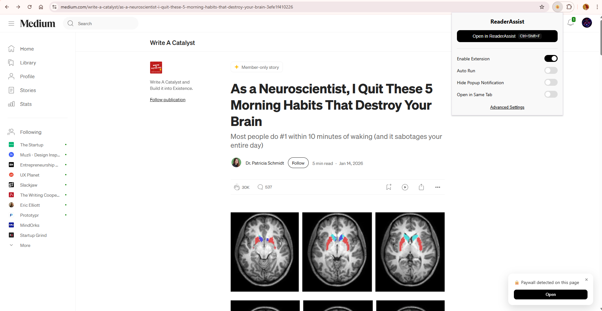

# ReaderAssist – Smart Reader Assistant


Smart article detection with a clean alternate-view switcher.

ReaderAssist detects membership or access indicators on supported websites and displays a subtle, non-intrusive popup that allows users to switch to an alternate viewing mode.

Built as a lightweight productivity tool with a modular architecture designed for future expansion.

## ✨ Features

- Membership / access notice detection
- Clean floating popup UI
- One-click alternate view action
- Auto-dismiss after 10 seconds
- Keyboard shortcut support
- Auto-run detection
- Hide popup notification
- Open in same tab options
- Settings dashboard (accessible via the `Options` page)

## ⌨️ Keyboard Shortcut

Default:

```bash
Ctrl + Shift + F
```

Customize at:

```url
chrome://extensions/shortcuts
```

## 🧠 How It Works

1. Content script monitors page content.
2. If a paywall indicator is detected:
     - If Auto Run is enabled: the extension will automatically open the alternate view.
     - Otherwise (Auto Run disabled and popup not hidden): a floating UI card appears.
3. User can:
     - Click Open to switch view
     - Click × to dismiss
     - Ignore it (auto-closes after 10 seconds)
4. Background service worker handles navigation logic.

The UI is isolated and designed to avoid conflicts with site styling.

## 🗂 Project Structure

```bash
.
├── manifest.json
├── background.js
├── popup/
│   ├── popup.html
│   ├── popup.js
│   └── popup.css
├── options/
│   ├── options.html
│   ├── options.js
│   └── options.css
├── content/
│   ├── content.js      # Entry point
│   ├── detector.js     # Paywall detection logic
│   └── ui.js           # Popup lifecycle + interaction
├── styles/
│   └── popup.css
├── assets/
│   └── icons/
└── screenshots/
```

## 🚀 Installation (Developer Mode)

1. Open Chrome
2. Go to chrome://extensions/
3. Enable Developer Mode
4. Click Load unpacked
5. Select the project folder

## 📸 Screenshots

Pin ReaderAssist to your toolbar, open an article with membership access, and the floating popup (bottom-right) will appear showing the `Open` action, settings, and auto-run state — see the example below.

     

## 🔮 Up coming features...

- Multi-site support
- Per-site enable/disable toggle
- Optional analytics (local only)

## 🙌 Credit

This extension integrates with and relies on the service provided by Freedium for alternate article viewing functionality.

All alternate viewing logic and content delivery are handled by Freedium’s infrastructure.

Full credit for the alternate viewing capability belongs to the Freedium project.

## ⚠️ Disclaimer

This project is intended as a personal productivity tool.

Users are responsible for ensuring their use complies with the terms of service of any website accessed.

## 📄 License

This project is licensed under the MIT License — see the [LICENSE](LICENSE) file for details.
